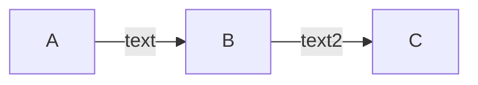
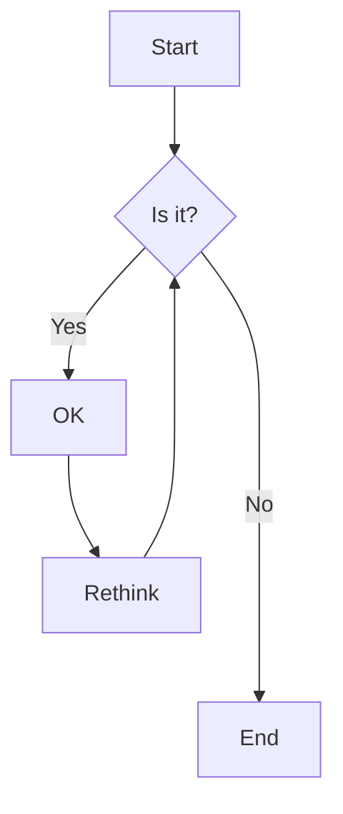
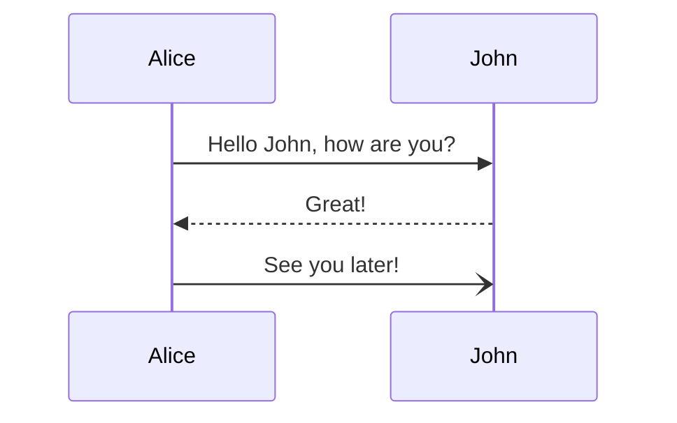
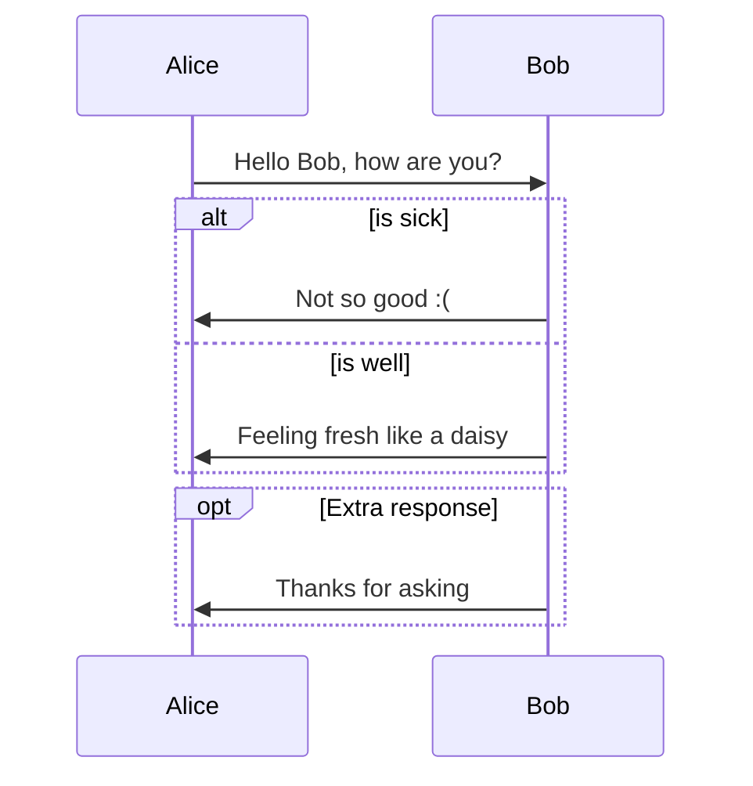
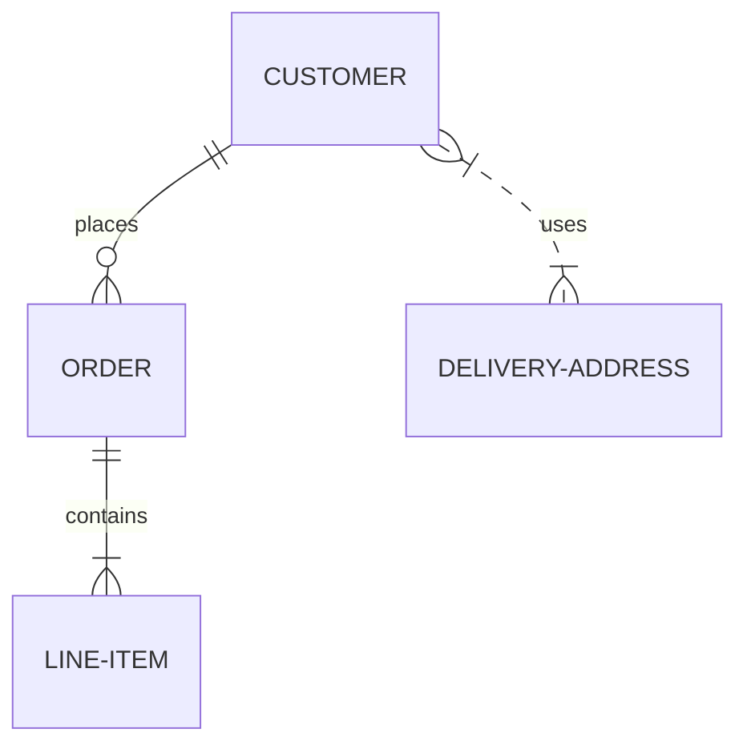

# metalsmith-mermaid

[](https://www.npmjs.com/package/metalsmith-mermaid)
[](https://www.npmjs.com/package/metalsmith-mermaid)

[](https://snyk.io/test/npm/metalsmith-mermaid)
[](https://codecov.io/gh/emmercm/metalsmith-mermaid)
[](https://github.com/emmercm/metalsmith-plugins/blob/main/LICENSE)

A Metalsmith plugin to render Mermaid diagrams in files.

From the official [Mermaid](https://mermaid-js.github.io/mermaid/#/) documentation:

> Mermaid is a JavaScript based diagramming and charting tool that uses Markdown-inspired text definitions and a renderer to create and modify complex diagrams. The main purpose of Mermaid is to help documentation catch up with development.

Mermaid supports a number of different diagrams including flowcharts, sequence diagrams, class diagrams, state diagrams, entity relationship diagrams (ERDs), user journeys, Gantt charts, pie charts, requirements diagrams, and more. See the examples section below for a few of these.

This Metalsmith plugin works by finding all ```` ```mermaid ```` code blocks in Markdown files, rendering them to SVG, and replacing them with the SVG in-place.

You should run this plugin before any Markdown rendering plugins such as [`@metalsmith/markdown`](https://www.npmjs.com/package/@metalsmith/markdown).

## Installation

```bash
npm install --save metalsmith-mermaid
```

## JavaScript Usage

This plugin requires ES6 syntax:

```javascript
import path from 'path';

import Metalsmith from 'metalsmith';
import mermaid    from 'metalsmith-mermaid';

Metalsmith(path.resolve())
    .use(mermaid({
        // options here
    }))
    .build((err) => {
        if (err) {
            throw err;
        }
    });
```

## Options

### `markdown` (optional)

Type: `string` Default: `**/*.md`

A [`micromatch`](https://www.npmjs.com/package/micromatch) glob pattern to find Markdown files.

### `mermaid` (optional)

Type: `object` Default:

```json
{
    "theme": "neutral",
    "er": {
      "diagramPadding": 10
    },
    "flowchart": {
      "diagramPadding": 10
    },
    "sequence": {
      "diagramMarginX": 10,
      "diagramMarginY": 10
    },
    "gantt": {}
}
```

An object of [Mermaid options](https://github.com/mermaid-js/mermaid/blob/develop/docs/Setup.md#configuration).

## Examples

Here are a few examples from the [official documentation](https://mermaid-js.github.io/mermaid/#/) to get an idea of what types of diagrams are possible.

Flowcharts:

`````markdown

`````

`````markdown

`````

Sequence diagrams:

`````markdown

`````

`````markdown

`````

Entity relationship diagrams (ERDs):

`````markdown

`````

## Changelog

[Changelog](./CHANGELOG.md)
