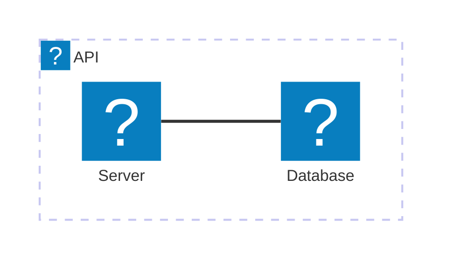
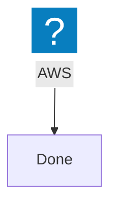

# Icon packs

```mermaid
architecture-beta
    group api(logos:aws-lambda)[API]

    service db(logos:aws-aurora)[Database] in api
    service server(logos:aws-ec2)[Server] in api

    db:L -- R:server
```

```mermaid
flowchart TD
    A@{ icon: "logos:aws", label: "AWS" } --> B[Done]
```
